# Lab3Web
*Membuat List, Table dan Form*
*1. Membuat List* 
 Membuat Dokument HTML dengan Nama file lab3_list.html
 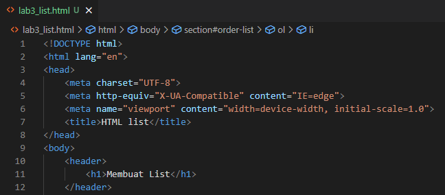

 lalu membuat ordered list seperti berikut.
 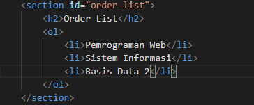

 Maka hasilnya seperti berikut.
 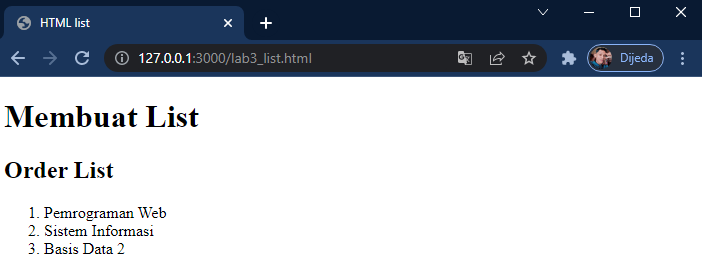

 lalu kita membuat unorder list dengan tag sebagai berikut.
 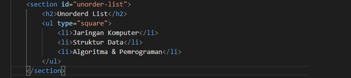

 Maka hasil output nya seperti berikut
 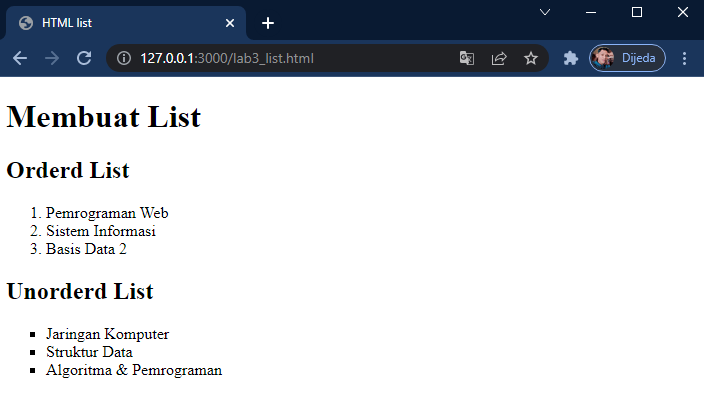

 Membuat Description list dengan contoh sebagai berikut
 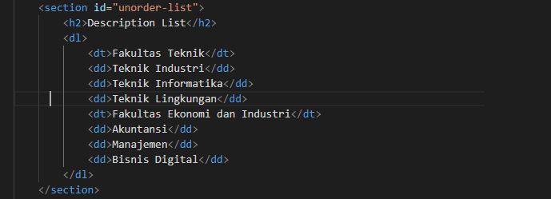 

 dengan hasil contohnya seperti ini.
 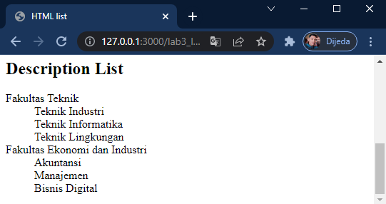

 *2. Membuat dalam bentuk tabel*
 dengan membuat file baru dengan nama lab3_tabel.html
 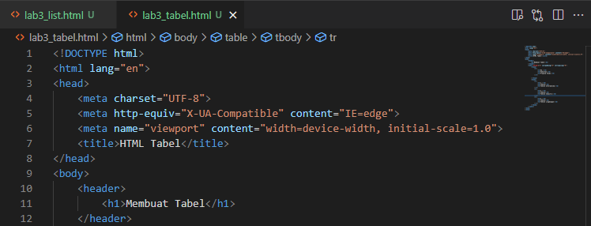

 selanjutnya kita membuat dengan kode tag untuk membuat tabel sederhanya seperti berikut.
 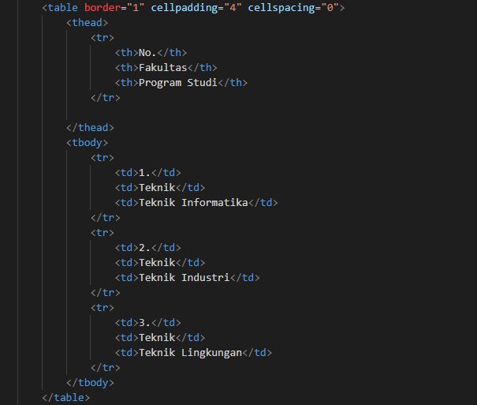
 Fungsi cellpadding dan cellspacing yaitu untuk mengatur margin dan padding pada tag tabel

 dan hasilnya seperti ini.
 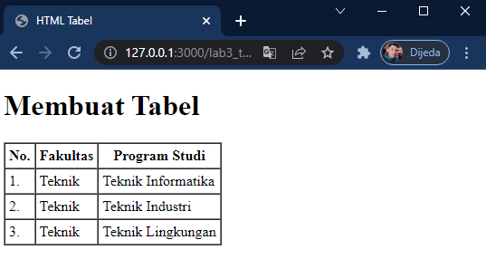

 *-Menggabungkan Sel Data*
 lalu kita akan mencoba menggabungkan sel data dengan menggunakan atribut rowspan dan colspan untuk menggabungkan baris secara vertikal dan colspan secara horizontal.
 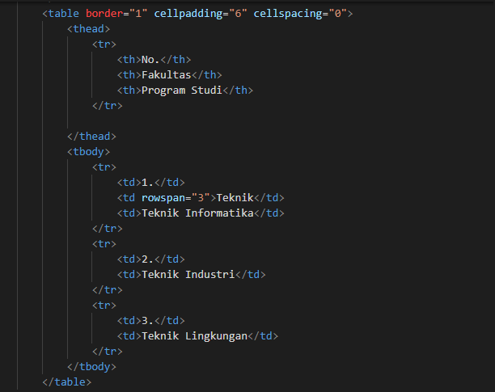

 Dengan hasil output sebagai berikut
 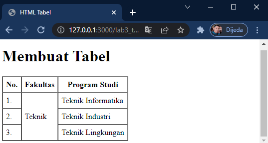

 *3. Membuat Form*  
 kita membuat file baru lagi dengan nama lab3_form.html
 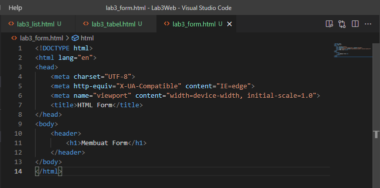

 kemudian kita tambahkan kode tag untuk membuat tabel sederhana seperti form
 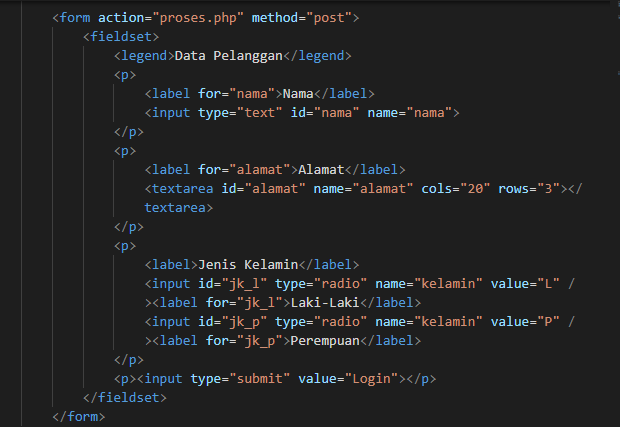

 dengan hasilnya seperti ini
 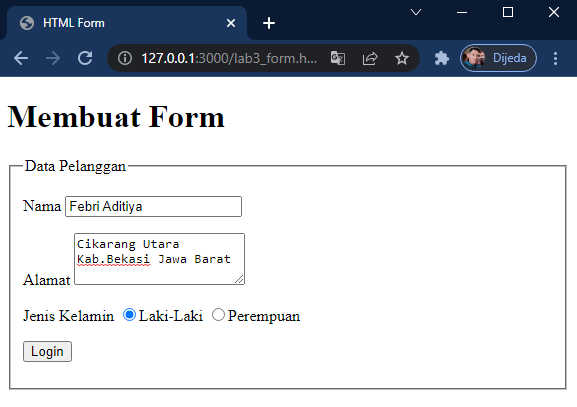

 Agar tampilan form lebih menarik dan enak dilihat kita tambahkan CSS dengan style sebagai berikut 
 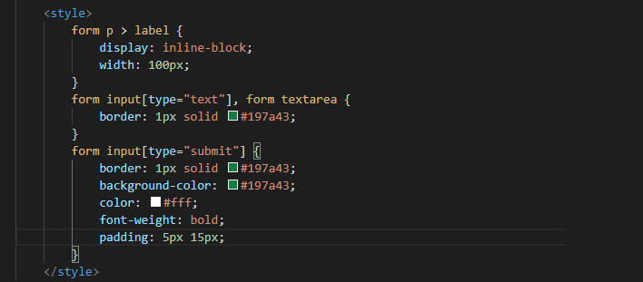

 dan hasil tampilannya seperti ini.
 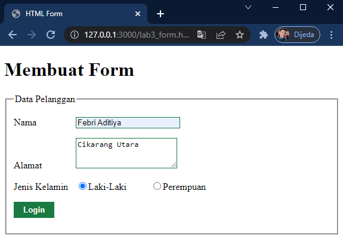

 *Pertanyaan dan Tugas*
 1. Buatlah form yang menampilkan dropdown dan listbox dengan multiple selection

*Jawab*

*- Pertama Masukkan tag dropdown dan Menambahakan nama provinsi di dalam nya seperti berikut di hmtl nya.*
[18.png](img/18.png)

lalu kita tambahkan style CSS agar tampilan lebih menarik.
[19.png](img/19.png)

Dan hasil dari dropdown nya seperti berikut.
[20.png](img/20.png)

